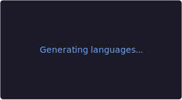

<div align="center">

## z3er0day

`Fullstack` &nbsp;·&nbsp; `Mobile` &nbsp;·&nbsp; `Systems` &nbsp;·&nbsp; `Bots`

&nbsp;

</div>

<br/>

**/status**

Building across all layers — browser to server, web to native, scripted to compiled.  
React + TypeScript on the frontend, Python on the backend, Swift/Kotlin for mobile, C++/C# for systems.

**/now**

- Fullstack web with React, TypeScript, Prisma and Node.js
- iOS and Android native development — Swift / Kotlin
- Python bots, automation and backend services
- Systems and low-level code in C++ and C#

**/stack**

```
main           →  TypeScript / React / architecture / project foundation
feat/frontend  →  React / Next.js / Tailwind / Prisma / Vite / responsive UI
feat/mobile    →  Swift / UIKit / SwiftUI / Kotlin / Jetpack Compose
feat/backend   →  Python / FastAPI / Django / REST APIs / bots / automation
feat/systems   →  C++ / C# / performance-critical code / graphics / game dev
feat/data      →  PostgreSQL / SQLite / Redis / Docker / ORMs / ETL
feat/devops    →  Linux / Nginx / Docker / CI/CD / VPS / containers
release/full   →  web + mobile + backend + systems + infra
```

**/selected**

> Work in progress — projects will appear here

**/links**

> Coming soon
